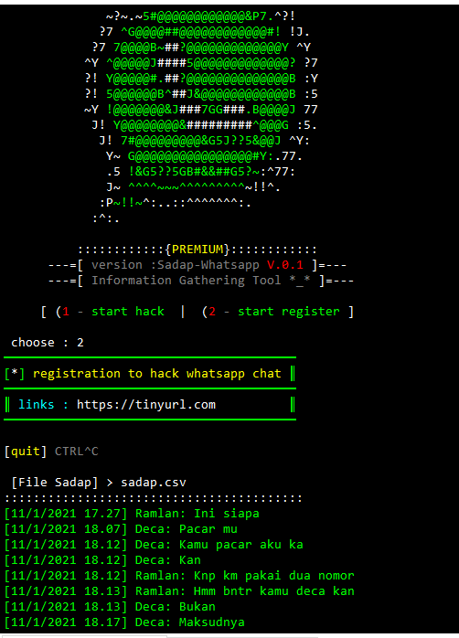

# Sadap-WhatsApp
Saat Ini Versi 0.1, Tool Premium Free! [WHAT?] apa yang bisa dilakukan oleh tools Untuk Hack Nomor WhatsApp ini.

(1) Mengambil Informasi Nomor Telepon Seluler WhatsApp

(2) Menemukan Nomor yang Bocor Pada Media Sosial Mereka

(3) Menemukan Foto Profil Yang Mereka Unggah Di WhatsApp

(4) Membuat/Mengirim Verifikasi Sms Palsu Pada Nomor Luar

(5) Membuat Pesan WhatsApp Pelacakan Menggunakan Tautan Api Redirect.

(6) Sadap/Spy Chat WhatsApp Menggunakan Jasa Admin Register 

tool ini bagus disaat anda mengalami penipuan atau terror
atau hanya sekedar iseng, curiga kepada pasangan atau hanya cek validasi nomor.

# screenshot

berikut tampilan track nomor

berikut tampilan sadap whatsapp register

# tutor menginstall nya

sudo apt-get update

sudo apt-get install git

Luncurkan git clone

git clone https://github.com/thony-gans/Sadap-WhatsApp

Masuk Ke Dir : cd Sadap-WhatsApp

Jalankan lanjutan : ./install.sh

Nah disini Pilih Sesuai Device Disini Saya Pilih Kali-Linux

Jalankan Script : ./keys.sh

[ INGAT!!! ] START HACK Nomor Valid ( +62xxxxxxxxx )

